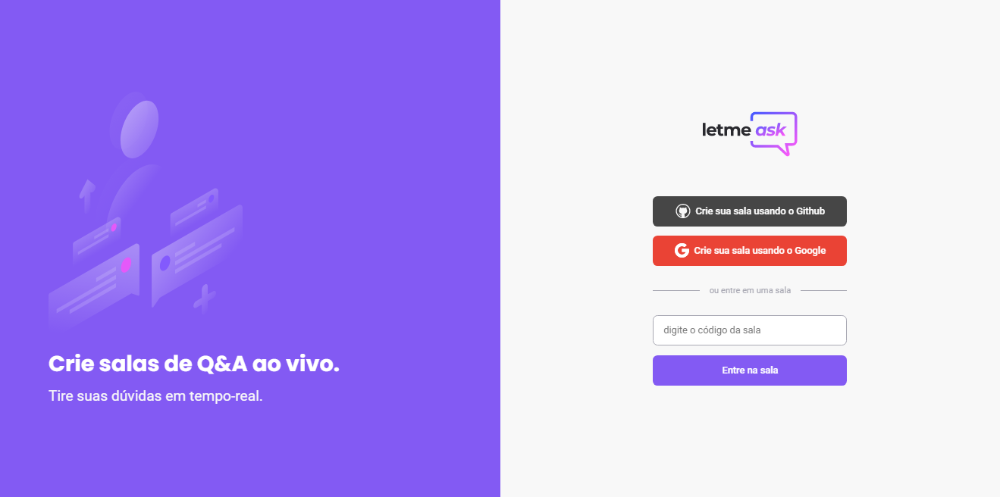

<p align="center">
  
</p>

<h1 align="center">
    
</h1>

<br>

## 🧪 Technologies

This project was developed with the following technologies:

- [React](https://reactjs.org)
- [Firebase](https://firebase.google.com/)
- [TypeScript](https://www.typescriptlang.org/)

## 🚀 Features added by me 

-Login with github<br/>
-Logout Feature<br/>
-Modals<br/>
-Responsive(In process)<br/>
-PWA(In process)<br/>

## ✈️ Installation and use

```bash
# Open a terminal and copy this repository with the command
git clone https://github.com/Brunoocn/Dtmoney.git
# or use the download option.
# Open the folder with
cd Letmeask
# Install dependencies
yarn install
# Run the aplicattion
yarn start
```

The app will be available in your browser at the address http://localhost:3000

Remembering that you will need to create an account on [Firebase](https://firebase.google.com/) and a project to make a Realtime Database available.

## 💻 Project

Letmeask is perfect for content creators to create Q&A rooms with their audience in a very organized way.

## 🔖 Layout

You can view the project layout through the link below:

- [Layout Web](https://www.figma.com/community/file/1009824839797878169/Letmeask)

You must have an account on [Figma](http://figma.com/) to access it.
